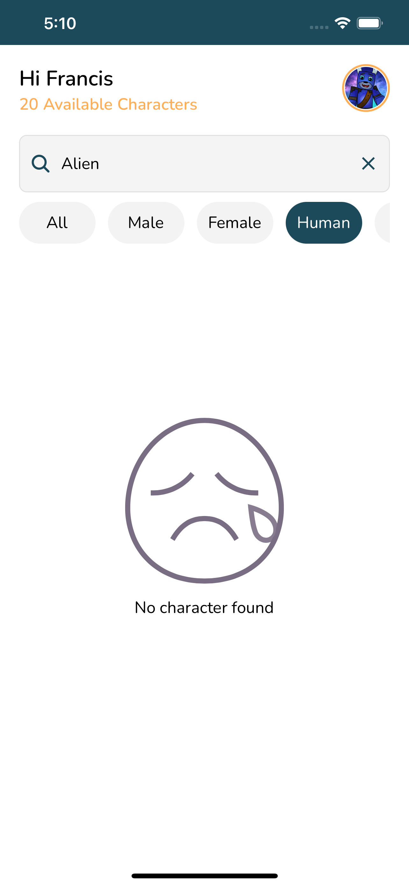
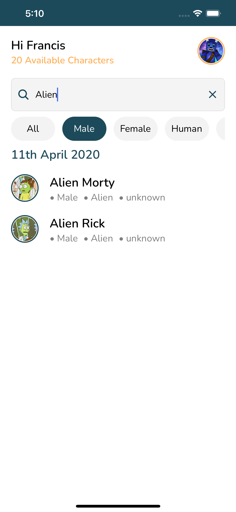
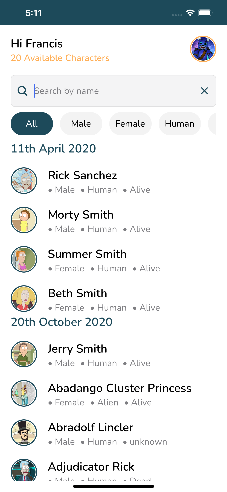

# Recruitment task for helicarrier







Run Locally by cloning the project

```bash
  git clone https://github.com/Nchekwube1/Helicarrier_Assessment
```

Go to the project directory

```bash
  cd Helicarrier_Assessment
```

To install dependencies

```bash
run npm install or yarn
```

To install pods

```bash
run cd ios && pod install && cd ..
```

To start the metro server

```bash
run npm start or yarn start
```

To run on android device

```bash
 npx react-native run-android
```

To run on ios device

```bash
 npx react-native run-ios
```
